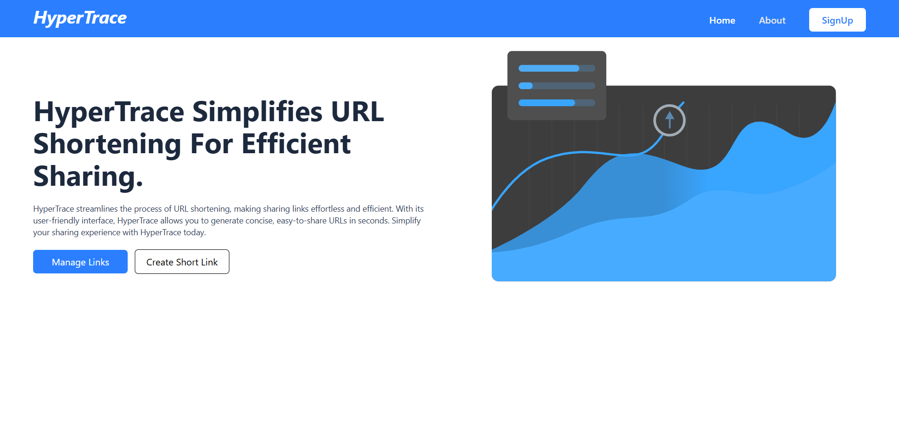
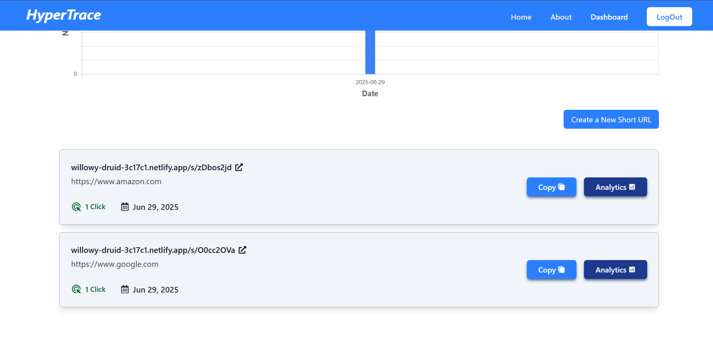
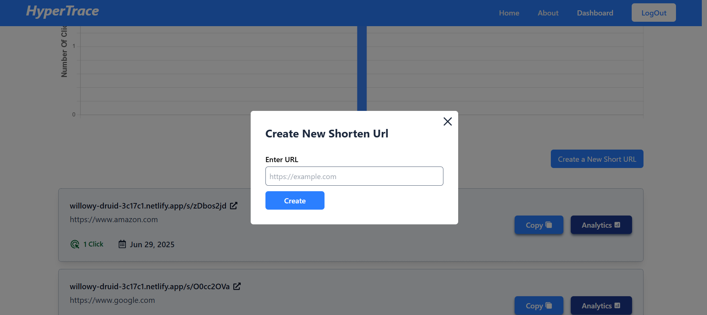
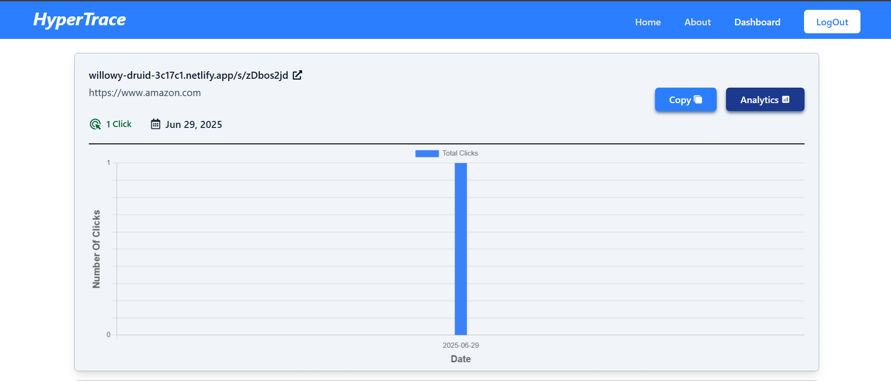

# 🚀 HyperTrace

A modern **URL shortening platform** built with **React (Vite)** and **Spring Boot**, featuring powerful analytics, secure token-based access, and a clean responsive UI. Deployed with **Docker** and hosted on **Netlify** (Frontend) and your preferred backend cloud (or local Docker).


# Screenshots





---

## 🛠️ Tech Stack

| Layer     | Technology                            |
|-----------|----------------------------------------|
| Frontend  | React (Vite), Tailwind CSS, Axios, React Query |
| Backend   | Spring Boot (Java 17), Spring Security, REST APIs |
| Database  | PostgreSQL / H2 (configurable)         |
| Auth      | JWT (Token-based Auth)                 |
| DevOps    | Docker, Docker Compose                 |
| Hosting   | Netlify (Frontend), Docker (Backend)   |

---

## 📦 Features

- 🔗 URL shortening with custom aliases
- 📊 Click tracking and daily analytics
- 👤 JWT-based secure user registration & login
- 🌐 Public + Private APIs
- ⚛️ Typed API integration using Axios & React Query
- ☁️ Deployed using Docker and Netlify

---

## ⚙️ Setup Instructions

### 🔧 Prerequisites

- Java 17+
- Node.js v18+
- Docker & Docker Compose
- Maven


## 🔐 Security

- JWT authentication for secure endpoints
- CORS configured to allow frontend origin
- Public/private route handling in backend and frontend

---

## 📁 Project Structure

```
my-project/
│
├── frontend/         # React Vite frontend
│   ├── src/
│   └── .env
│
├── backend/          # Spring Boot backend
│   ├── src/
│   └── .env
│
└── README.md
```

